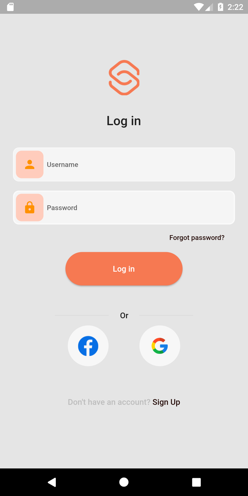
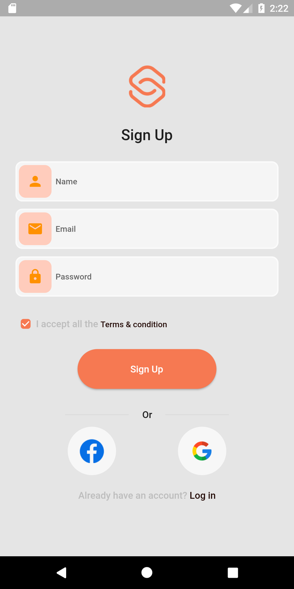
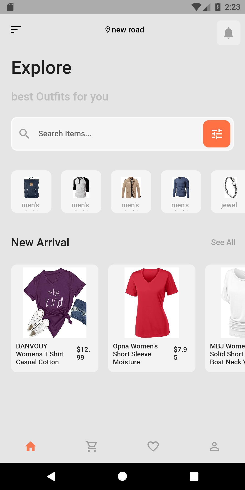
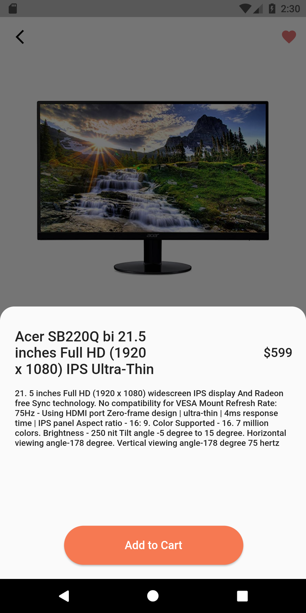
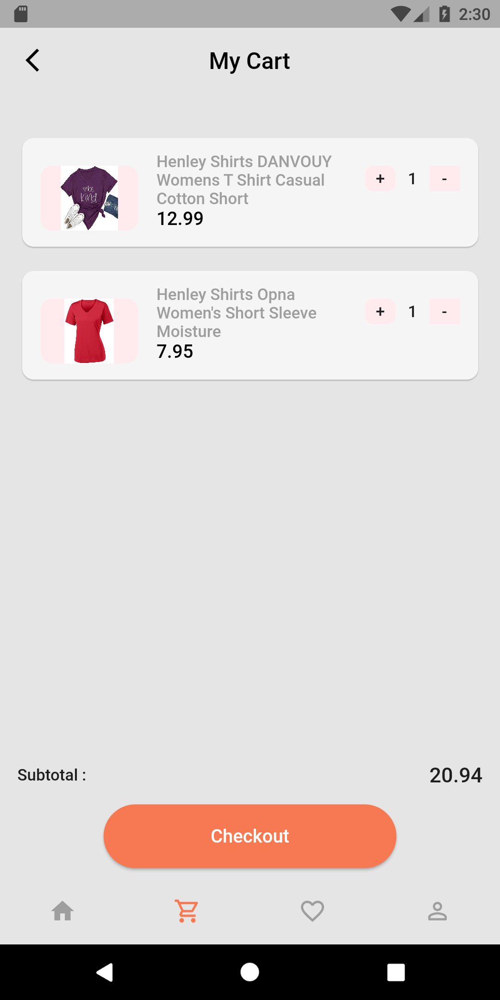
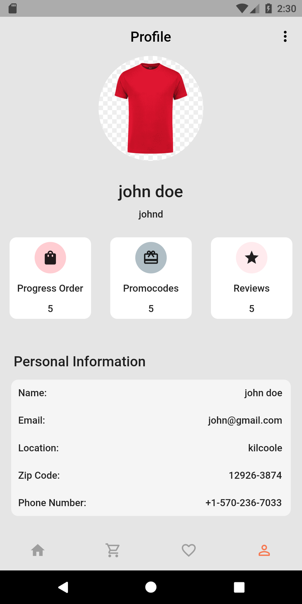

# e_commerce

An online shopping app built with Dart and Flutter

## Getting Started

This app allows users to view category/products add produt to cart with the consumption of an APi.

## Packages used:
- Flutter Audio query
- Salmon bottom Bar
- flutter Audio manager

## screenshots
## Login

## Signup

## Home

## View

## Cart

## Profile

